# 🛑 App Block 🛑 <a id="top"></a>
## _Stop the Scroll, Embrace the Control_

> An Android app to help you curb distracting apps by shaming, delaying, and summarizing your usage.

---

<a id="table-of-contents"></a>
## 📑 Table of Contents

- [Features](#features)  
- [Demo](#demo)  
- [Getting Started](#getting-started)  
  - [Prerequisites](#prerequisites)  
  - [Installation](#installation)  
- [Usage](#usage)  
  - [Granting Permissions](#granting-permissions)
  - [Manage Your Blocked Apps](#manage-your-blocked-apps)
  - [Usage Summary](#usage-summary)
  - [Manage Tasks](#manage-tasks)
- [Configuration](#configuration)
  - [Build](#build-manifest)
  - [Resources](#resources)
  - [Defaults](#defaults)
  - [Excluded Apps](#excluded-apps)
  - [Menu & Layout](#menu-&-layout)
  
- [Project Structure](#project-structure)  
- [License](#license)

</details>


---

<a id="features"></a>
## ✨ Features

- **Accessibility-powered Real-time App Detection**  
  Leverages Android’s Accessibility Service to monitor which app is foregrounded—**all on-device**, no personal data leaves your device.

- **Soft-lock (Delay & Shame)**  
  Configure a per-app delay (e.g. 10 s) before launch, with a countdown notification and optional “shame” overlay if you press ahead.

- **Time-based Locks**  
  Define “do-not-disturb” windows per app (e.g. social media blocked 09:00 – 17:00).

- **Persistent & Priority Notifications**  
  Ongoing reminders appear in your notification shade, powered by the **POST_NOTIFICATIONS** permission.

- **Usage Summary**  
  View weekly charts of your app launches for self-reflection.

- **Task Scheduler**  
  Create recurring reminders (e.g. “Review screen time daily”) right in the app.


---

<a id="demo"></a>
## 🎬 Demo

<table>
  <tr>
    <td>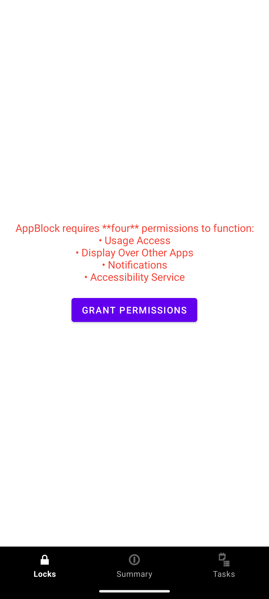</td>
    <td>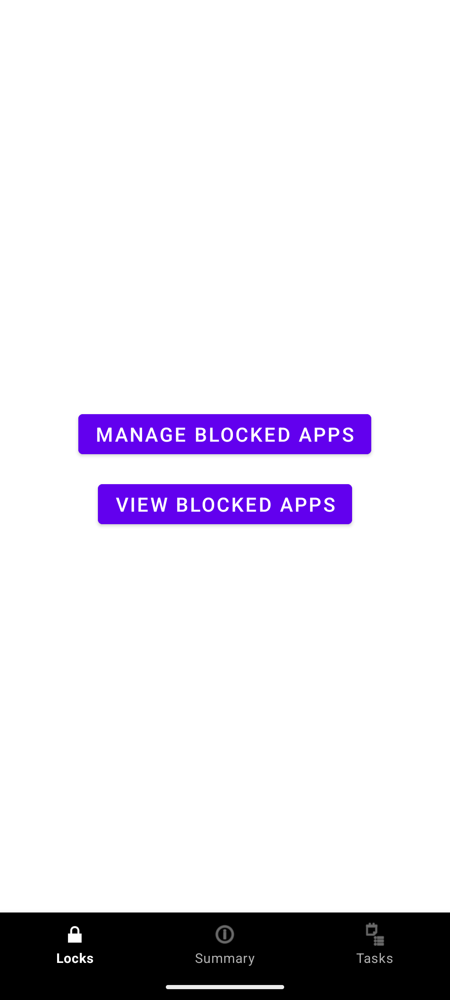</td>
    <td>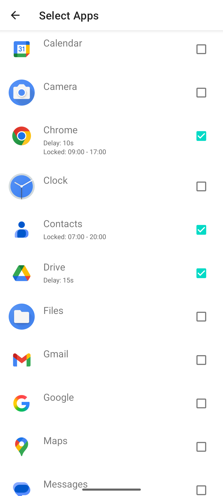</td>
    <td>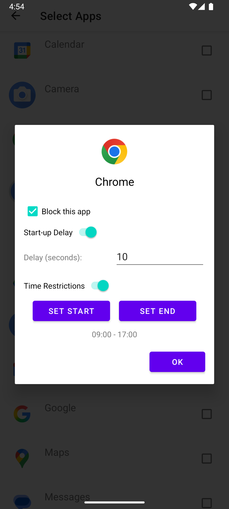</td>
  </tr>
  <tr>
    <td>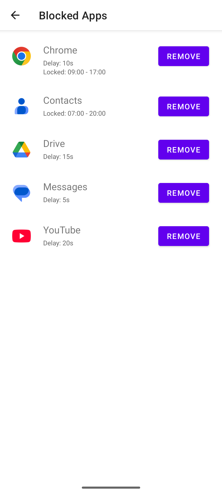</td>
    <td>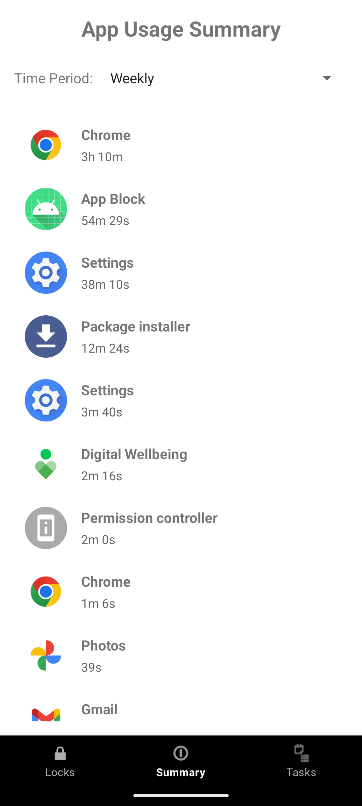</td>
    <td>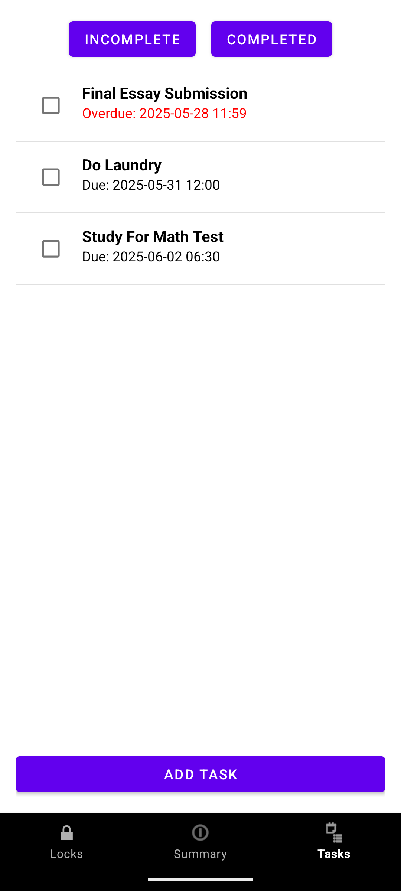</td>
    <td>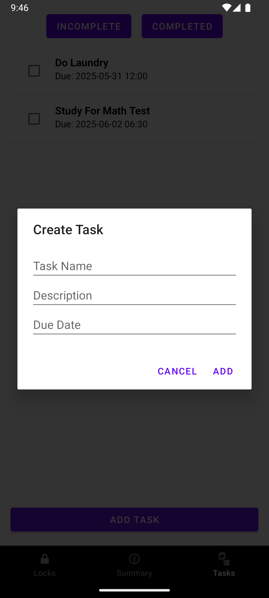</td>
    

  </tr>
  <tr>
    <td>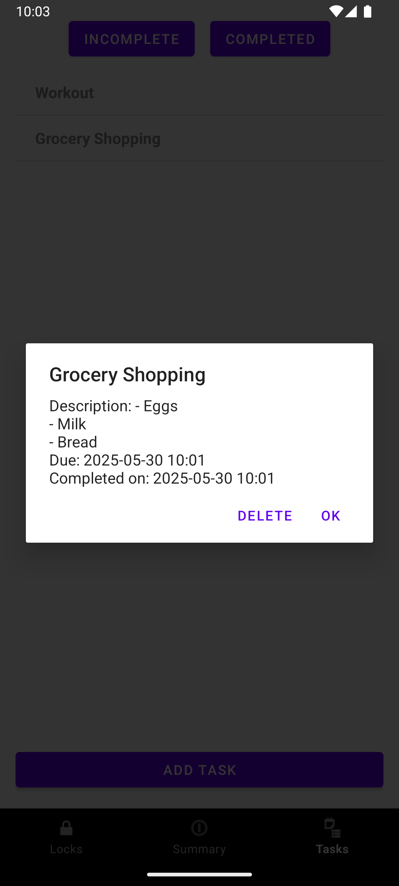</td>
    <td>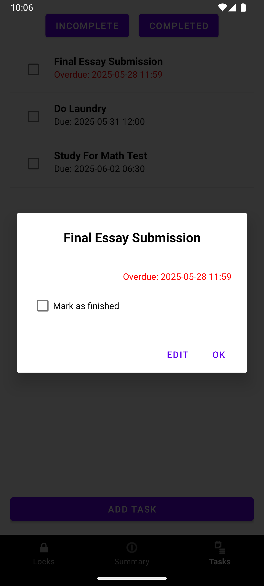</td>
    <td>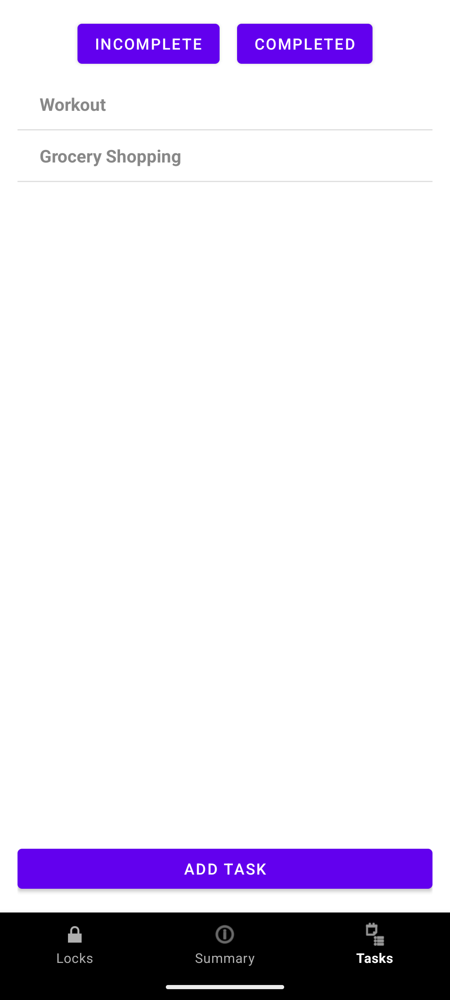</td>
    <td>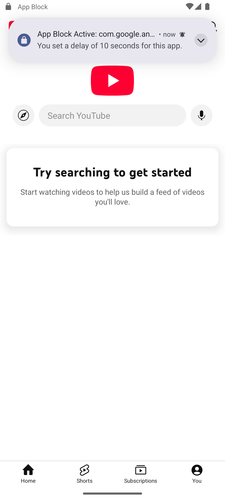</td>
  </tr>
  <tr>
    <td>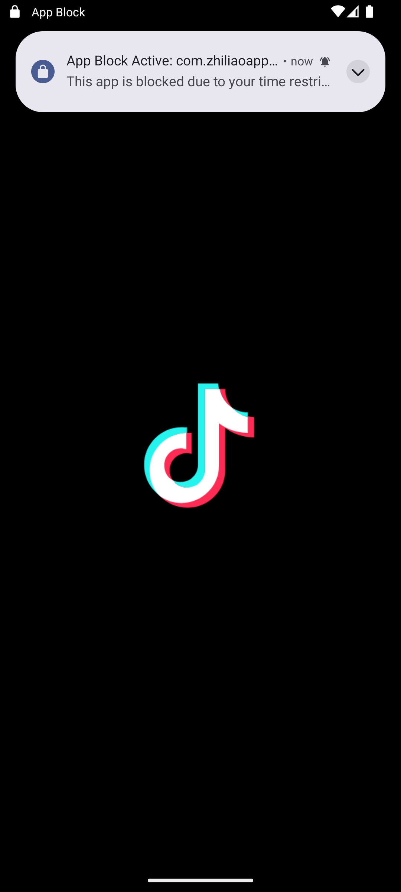</td>
    <td>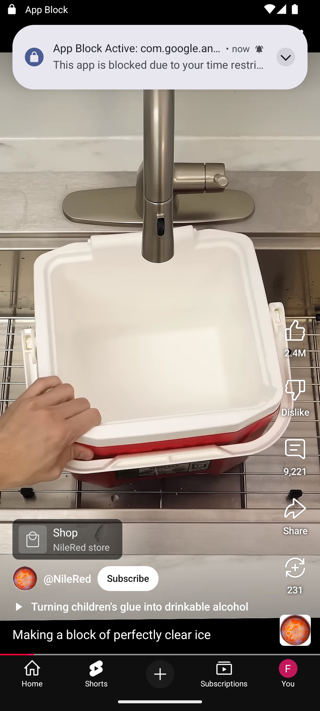</td>
  </tr>
</table>


---

<a id="getting-started"></a>
## 🚀 Getting Started

<a id="prerequisites"></a>
### Prerequisites

- Android Studio Arctic Fox or later  
- Android SDK 21+  
- Kotlin 1.7+  

<a id="installation"></a>
### 📥 Installation

##### If running on Android Studio
1. Clone this repo  
   ```bash
   git clone https://github.com/Scatter2Darknes/AppBlockv1.0
2. Run this command in terminal
    ```bash 
    cd appblock
3. Open in Android Studio
4. Build & run on your device/emulator
    
##### 📦 Download For Android Mobile Device

Grab the latest APK and sideload it onto your device:

**❗(Currently working on it, not ready yet)❗**

<!--- **Latest stable**:  -->
<!--  [Download AppBlock v1.0.0 (APK)](https://github.com/yourusername/appblock/releases/download/v1.0.0/appblock-v1.0.0.apk)-->
 
> **Tip:** You may need to allow “Install unknown apps” in your Android settings for your browser or file manager.

---

<a id="usage"></a>
## 📊 Usage

<a id="granting-permissions"></a>
### 1. **Granting Permissions**  
   - Open the app.  
   - Tap **Grant Permissions** to cycle through each required setting:  
     1. **App Usage Access** → toggles the Usage-Access screen  
     2. **Display Over Other Apps** → toggles the Overlay screen  
     3. **Notifications** → system dialog for POST_NOTIFICATIONS  
     4. **Accessibility Service** → toggles the Accessibility screen  
   - Once _all four_ are granted, the **Manage Blocked Apps** and **View Blocked Apps** buttons appear.
   - If _**not all four**_ are granted, the above will not appear and access to lock features will be hidden.

<a id="manage-your-blocked-apps"></a>
### 2. **Manage Your Blocked Apps**  
   - Tap **Manage Blocked Apps**.  
   - In the list, toggle the checkbox next to any app you want to block.  
   - Configure each app’s **Delay** (soft-lock), or **Time Lock** window.

### 3. **Using Soft-Lock & Shame Screens**  
   - When you launch a blocked app:  
     - If you’ve configured a delay, you’ll get a countdown notification.  
     - If no delay is set, or during your “off hours,” you’ll see a brief “shame” screen reminding you of your goal.
    
### 4. **Disabling a Block**  
   - Reopen **Manage Blocked Apps** and untoggle an app’s checkbox to remove its block.  
   - All per-app settings (delay & time windows) are saved across sessions.

<a id="usage-summary"></a>
### 5. **View Your Stats**  
   - Switch to the **Summary** tab via the bottom navigation to see your daily/weekly usage.  
   - The most used apps will apear at the top.


<a id="manage-tasks"></a>
### 6. **Manage Tasks**
   - Switch to the **Tasks** tab via the bottom navigation to (see/add/modify) your tasks.
   - Can check tasks as **completed** via clicking checkbox or edit tasks by clicking on them.

---

<a id="configuration"></a>
## ⚙️ Configuration

You can tweak the following settings to customize how AppBlock behaves:

<a id="build-manifest"></a>
1. **Build & Manifest**  
   - `minSdkVersion` (in `build.gradle`): minimum supported Android version (default: 21)  
   - `targetSdkVersion` (in `build.gradle`): should match latest SDK (e.g. 35)  
   - `AndroidManifest.xml`:  
     ```xml
     <uses-permission android:name="android.permission.PACKAGE_USAGE_STATS" tools:ignore="ProtectedPermissions"/>
     <uses-permission android:name="android.permission.SYSTEM_ALERT_WINDOW"/>
     <uses-permission android:name="android.permission.POST_NOTIFICATIONS"/>
     <uses-permission android:name="android.permission.FOREGROUND_SERVICE"/>
     <meta-data android:name="android.allow_usage_access" android:value="true"/>
     ```
<a id="resources"></a>
2. **Resources**  
   - `res/values/strings.xml` (notification channel):  
     ```xml
     <<string name="invalid_delay">Enter a number ≥1</string>
     ```
   - `res/values/colors.xml`:  
     ```xml
     <color name="purple_500">#6200EE</color>
     <color name="red">#F44336</color>
     ```
   - `res/anim/fade_in.xml`:
     ```xml
     android:duration="300"
     ```
<a id="defaults"></a>
3. **Defaults & Constants**  
   ```kotlin
   // blockDelay in AppInfo.kt
   var blockDelay: Int = 10 // 10 second delay on default
   
   // pollInterval in AppLaunchDetector.kt
   private val pollInterval = 1000L // (1 second)
   private val notificationCooldown = 2000L // (2 seconds)
  ```
<a id="excluded-apps"></a>
4. **Excluded Apps**
   - Edit `ExcludedApps.kt` to add/remove package names that should never be blocked
   - Default packages include:
      - `com.android.settings` System Settings
      - `com.example.appblock`  App Block itself
      - `com.android.phone` Phone dialer
      - `com.google.android.dialer`
      - `com.android.emergency` Emergency Services
    
<a id="menu-&-layout"></a>
5. **Menu & Layout**
   - `res/menu/bottom_nav_menu.xml`: replace icons or title as needed
   - `res/layout/overlay_blocking.xml`: customize your overlay/shame screen appearance

---

<a id="project-structure"></a>
## 📁 Project Structure

```
AppBlock/
├── .gitignore
├── .kotlin/
│ └── sessions/
├── app/
│ ├── .gitignore
│ ├── build.gradle.kts ← module-level Gradle script (app)
│ ├── kevin_changes.txt ← developer notes / changelog
│ ├── proguard-rules.pro ← ProGuard/R8 configuration
│ ├── src/
│ │ ├── androidTest/
│ │ │ └── java/com/example/appblock/ExampleInstrumentedTest.kt
│ │ ├── main/
│ │ │ ├── AndroidManifest.xml
│ │ │ ├── java/com/example/appblock/
│ │ │ │ ├── AppAdapter.kt
│ │ │ │ ├── AppBlockAccessibilityService.kt
│ │ │ │ ├── AppBlockApplication.kt
│ │ │ │ ├── AppInfo.kt
│ │ │ │ ├── AppLaunchDetector.kt
│ │ │ │ ├── AppListActivity.kt
│ │ │ │ ├── BlockedAppsActivity.kt
│ │ │ │ ├── BlockingOverlayService.kt
│ │ │ │ ├── DashboardActivity.kt
│ │ │ │ ├── ExcludedApps.kt
│ │ │ │ ├── lock/LockFragment.kt
│ │ │ │ ├── MainActivity.kt
│ │ │ │ ├── MonitoredAppsActivity.kt
│ │ │ │ ├── NotificationHelper.kt
│ │ │ │ ├── summary/
│ │ │ │ │ ├── AppUsageInfo.kt
│ │ │ │ │ ├── SummaryAdapter.kt
│ │ │ │ │ ├── SummaryFragment.kt
│ │ │ │ │ └── SummaryActivity.kt
│ │ │ │ ├── tasks/
│ │ │ │ │ ├── Task.kt
│ │ │ │ │ ├── TaskDueReceiver.kt
│ │ │ │ │ └── TaskFragment.kt
│ │ │ │ ├── TimeRange.kt
│ │ │ │ ├── ui/theme/
│ │ │ │ │ ├── Color.kt
│ │ │ │ │ ├── Theme.kt
│ │ │ │ │ └── Type.kt
│ │ │ │ └── UsagePermissions.kt
│ │ │ └── res/
│ │ │ ├── anim/ (fade, slide, shake animations)
│ │ │ ├── color/nav_item_color.xml
│ │ │ ├── drawable/ (icons, vector assets, blocked-app icons, etc.)
│ │ │ ├── layout/ (all XML layouts: activities, fragments)
│ │ │ ├── mipmap-xxxhdpi/ (launcher icons)
│ │ │ ├── transition/ (slide animations for fragment transitions)
│ │ │ ├── values/ (colors.xml, strings.xml, themes.xml)
│ │ │ ├── values-night/ (night mode overrides)
│ │ │ ├── values-v29/ (API 29+ specific overrides)
│ │ │ └── xml/ (accessibility_service_config.xml, backup_rules.xml, data_extraction_rules.xml)
│ │ └── test/
│ │ └── java/com/example/appblock/ExampleUnitTest.kt
│ └── proguard-rules.pro
├── App Block.zip ← a packaged build or backup of the entire project
├── AppBlock_v0.0.0.zip ← older release archive (v0.0.0)
├── ave ← (extra file; remove if unused)
├── build.gradle.kts ← top-level Gradle build script
├── gradle/
│ ├── libs.versions.toml
│ └── wrapper/
│ ├── gradle-wrapper.jar
│ └── gradle-wrapper.properties
├── gradle.properties ← project-wide Gradle settings
├── gradlew ← Unix-shell Gradle wrapper
├── gradlew.bat ← Windows Gradle wrapper
├── README.md ← this file (overview, how to build/use)
└── settings.gradle.kts ← includes the :app module

```

- **`app/`**  
  - Android application module. Core Kotlin code lives under `src/main/java/com/example/appblock/`.  
  - `build.gradle.kts` configures dependencies, SDK versions, Kotlin settings.  
  - `proguard-rules.pro` holds ProGuard/R8 rules.  
  - `src/androidTest/` contains instrumentation tests (run on device/emulator).  
  - `src/main/AndroidManifest.xml` declares activities, services, and permissions.  
  - `src/main/res/` contains all XML resources (layouts, drawables, colors, themes, animations, etc.).  
  - `src/test/` contains local unit tests (run on the JVM).

- **`AppLaunchDetector.kt`**, **`BlockingOverlayService.kt`**, etc. (inside `app/src/main/java/com/example/appblock/`)
  - Implement the lock/delay/time-restriction logic (app blocking and overlays).

- **`summary/`** (inside `app/src/main/java/com/example/appblock/`)  
  - Holds code for the Usage Summary feature (e.g., `AppUsageInfo.kt`, `SummaryFragment.kt`).

- **`tasks/`** (inside `app/src/main/java/com/example/appblock/`)  
  - Contains the Tasks/Checklist feature (e.g., `Task.kt`, `TaskFragment.kt').

- **`gradle/`**, **`gradlew`**, **`gradlew.bat`**, **`build.gradle.kts`**, **`settings.gradle.kts`**, and **`gradle.properties`**  
  - Standard Gradle wrapper and project configuration files.  
  - Ensure anyone can build without installing Gradle separately.

- **`.kotlin/`**  
  - IDE session files. Can be ignored in version control.

- **`.gitignore`**  
  - Specifies files/folders Git should ignore (build outputs, IDE settings, local logs).

---

<a id="license"></a>
## 📜 License

Copyright (c) 2025 Kevin Chan, Jasper Ha, Justin Guan, Sahir Mukadam & Grishen Hestiyas

All Rights Reserved.

This software and associated documentation files (the “Software”) are the exclusive property of [Your Name or Organization]. No part of the Software may be reproduced, distributed, modified, transmitted, or used in any form or by any means, whether electronic or mechanical, without the prior written permission of the copyright holder.

[Go back to the top](#top) or to [Table of Contents](#table-of-contents)
